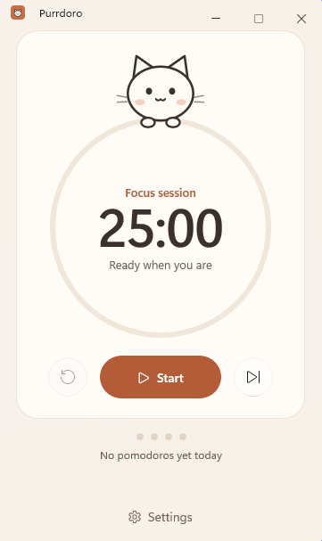
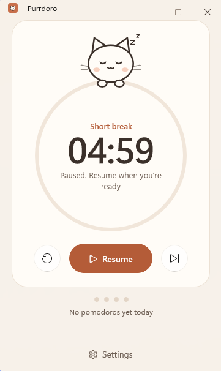

<div align="center">

# Purrdoro

### A cozy cat-themed pomodoro timer for Windows

Focus. Rest. Purr. Repeat.

</div>

<div align="center">


</div>

## Project Goal

My goal with Purrdoro is to build a pomodoro timer that feels a bit cuter than other implementations.
Before starting this project I had limited programming knowledge and mostly wrote simple CLI tools.
Working on it has given me a good understanding of WinUI 3.

## Features

- Focus, short break and long break sessions (25 / 5 / 15 minutes by default)
- Start, pause, resume, reset and skip
- A small cat that changes expression depending on what the timer is doing
- Adjustable durations and optional auto-start
- Notifications and a completion sound, both optional
- Light, dark and system themes
- Settings are saved between launches

## Running it

This app requires Windows 10 or 11, the [.NET 10 SDK](https://dotnet.microsoft.com/download/dotnet/10.0) and the [Windows App Runtime 2.5](https://learn.microsoft.com/windows/apps/windows-app-sdk/downloads).

```powershell
dotnet restore
dotnet build
dotnet run --project src/Purrdoro
```

## Project layout

- `src/Purrdoro`: the WinUI 3 app
- `src/Purrdoro.Core`: timer logic, settings and view models
- `tests/Purrdoro.Core.Tests`: tests for the core logic

## Screenshots

<p align="center">
  
  
</p>
